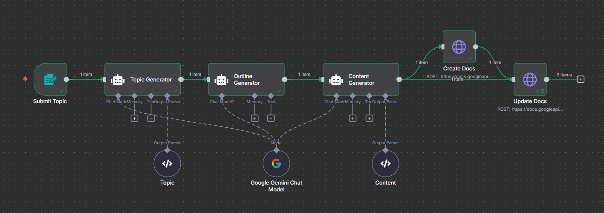

# n8n AI Article Generator to Google Docs

This repository contains a **workflow JSON** file for **n8n** that automatically generates articles using an **AI Agent** and saves them directly to **Google Docs**.  
The workflow is designed to streamline the content creation process, enabling quick and integrated execution.

## Docs
Article Generator n8n workflow

